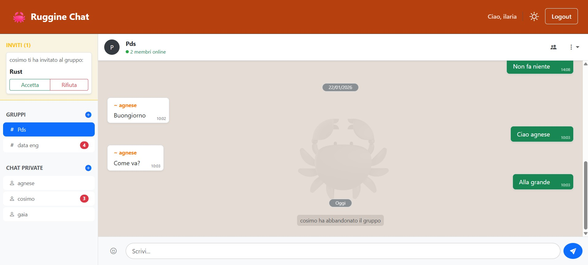

# Ruggine 🦀 – Real-Time Chat Application


Repository del progetto **Ruggine Chat**, sviluppato per l'insegnamento di Programmazione di Sistema (02GRSYG) A.A. 2024/25 presso il Politecnico di Torino. Il sistema implementa una piattaforma di messaggistica istantanea multi-utente ad alte prestazioni, basata su un backend asincrono in Rust e un frontend moderno in React. L'architettura è stata ottimizzata per minimizzare l'occupazione di memoria e la dimensione dell'eseguibile, integrando un sistema di monitoraggio continuo riguardo l'utilizzo delle risorse di CPU.

## Descrizione
Ruggine Chat è una piattaforma di messaggistica istantanea progettata per lo scambio di messaggi testuali in tempo reale. La piattaforma permette a ciascun utente, preventivamente autenticato, di interagire con altri utenti secondo due differenti modalità: **chat private** per conversazioni dirette uno a uno e **chat di gruppo** per conservazioni in team. L'accesso ai gruppi è consentito previa ricezione e accettazione di un invito, garantendo la partecipazione alle discussioni ai soli membri autorizzati. L'applicazione integra inoltre funzionalità di monitoraggio dello stato online dei partecipanti e un sistema di notifiche integrato per i messaggi non letti. Il tutto racchiuso in un'interfaccia moderna con supporto nativo al tema chiaro e scuro.

## Struttura Progetto
Il progetto è organizzato in due macro cartelle, pensate per separare la logica di sistema dalla parte relativa all'interfaccia utente.

**⚙️ Backend `/backend`**
- `error.rs` (in `src/error.rs`): modulo per la centralizzazione e la gestione degli errori applicativi. Definisce l'enum `AppError` e implementa la conversione automatica dai tipi di errore di sistema (e.g. *SQLx*, *Anyhow*) in risposte HTTP coerenti.
- `main.rs` (in `src/main.rs`): modulo per l'inizializzazione del server web. Configura il pool di connessioni al database, il runtime asincrono *Tokio*, le politiche di sessione e il routing principale di tutte le risorse API e WebSocket.
- `models.rs` (in `src/models.rs`): modulo per la definizione delle strutture dati condivise e delle entità del database. Mappa i record delle tabelle SQL in oggetti Rust e implementa i tratti necessari per l'autenticazione e la *serializzazione* JSON.
- `state.rs` (in `src/state.rs`): modulo per la gestione dello stato globale dell'applicazione `AppState`. Organizza le risorse condivise thread-safe come il pool del database, i canali di trasmissione della chat e le mappe di presenza degli utenti.
- `tasks.rs` (in `src/tasks.rs`): modulo per l'esecuzione di operazioni asincrone in background, specificamente dedicato al monitoraggio periodico delle risorse hardware (CPU e tempo di esecuzione) e alla loro archiviazione in file di log locali.
- `ws.rs` (in `src/ws.rs`): modulo per la gestione delle connessioni **WebSocket**, che regolamenta lo scambio di messaggi in tempo reale e la notifica degli eventi di presenza (online/offline) per i team e le comunicazioni private, previa verifica dei permessi.
- HANDLERS:
  - `auth.rs` (in `src/handlers/auth.rs`): modulo per la gestione delle procedure di registrazione, login e logout. Utilizza la libreria *bcrypt* per il hashing delle password. Gestisce l'integrazione con *axum-session* per creare la sessione utente nella tabella `sessions_table` e inizializza lo stato di presenza dell'utente nella *presence_map* al momento del login.
  - `personal.rs` (in `src/handlers/personal.rs`): modulo per la gestione delle chat private tra singoli utenti. Creazione nuove chat private, recupero della lista di chat esistenti, gestione dello stato di lettura.
  - `presence.rs` (in `src/handlers/presence.rs`): modulo per il monitoraggio in tempo reale dello stato online degli utenti.
  - `team.rs` (in `src/handlers/team.rs`): modulo dedicato alla gestione dei team. Creazione di team, gestione degli inviti (invio e accettazione), e invio dei messaggi di gruppo.
  - `mod.rs` (in `src/handlers/mod.rs`): esporta i sottomoduli (*auth*, *personal*, *presence*, *team*) tramite istruzioni `pub mod`, permettendo al resto dell'applicazione di accedere alle funzioni di gestione delle richieste.

**🎨 Frontend `/frontend`**
- `App` (in `src/App.jsx`): componente principale dell'applicazione. Avvolge tutti i componenti in un *ThemeContext.Provider* per gestire il tema (chiaro oppure scuro) e utilizza *Routes* e *Route* di *react-router-dom* per definire la navigazione;
- `LoginForm` (in `src/components/auth/AuthComponents.jsx`): contiene il form per effettuare il login, con i due campi di input necessari (*Username* e *Password*). Controlla le credenziali inserite (dopo aver cliccato sul bottone *Accedi*) e reindirizza l'utente alla pagina in cui partecipare ad una conversazione, in caso di login effettuato con successo. Il form contiene anche un bottone *Registrati* che rimanda l'utente alla pagina di registrazione;
- `RegisterForm` (in `src/components/auth/AuthComponents.jsx`): contiene il form per effettuare la registrazione, con i tre campi di input necessari (*Username*, *Password* e *Conferma Password*). Al click del bottone *Crea Account*, controlla i dati inseriti (*username* disponibile, password con minimo numero di caratteri, password coincidenti) e reindirizza l'utente alla pagina in cui effettuare il login. Il form contiene anche un bottone *Accedi* che rimanda l'utente alla pagina di login;
- `ChatModals` (in `src/components/chat/ChatModals.jsx`): componente che raccoglie tutte le finestre di dialogo dell'interfaccia chat. Modale per la creazione di un nuovo team, avvio di una nuova chat privata, rinomina di un team esistente, invito di un utente in un team, lista dei membri di un team con indicatori online/offline.
- `ChatPage` (in `src/components/chat/ChatPage.jsx`): componente principale della chat. Gestisce il caricamento della lista dei team e delle chat private di cui l'utente fa parte, la gestione degli inviti pendenti, la selezione della stanza attiva.
- `ChatWindow` (in `src/components/chat/ChatWindow.jsx`): finestra di chat attiva. Gestisce la distinzione visiva tra messaggi propri e altrui, la separazione temporale dei messaggi tramite badge, il selettore emojii, lo scrollo automatico verso il basso.
-  `NavHeader` (in `src/components/common/NavHeader.jsx`): barra di navigazione, contenente nome e logo dell'applicazione. In caso di utente loggato contiene il bottone di *Logout* e un messaggio di benvenuto (*e.g.* Ciao, *username*). Un bottone (con icona bootstrap *bi-sun* o *bi-moon*) consente inoltre di impostare la modalità chiara o la modalità scura (*dark mode* oppure *light mode*);
- `NotFoundComponent` (in `src/components/common/NotFoundComponent.jsx`): contiene un messaggio informativo che comunica all'utente che la pagina cercata non è stata trovata. Presenta un bottone *Ritorna all'homepage* che reindirizza l'utente alla pagina principale dell'applicazione;

## Installazione e Distribuzione

**⚙️ Backend (Rust)**
1. Entrare nella directory dedicata.
    ```bash
    cd backend
2. Modalità sviluppo. Per modalità release aggiungere il flag `--release`. Una volta avviato il server, il sistema genererà il file `cpu_log.txt` nella cartella corrente. Questo verrà aggiornato automaticamente ogni 2 minuti.
    ```bash
    cargo run [--release]
    ```

**🎨 Frontend (React)**
1. Entrare nella directory dedicata.
    ```bash
    cd frontend
2. Installare le dipendenze e avviare l'ambiente di sviluppo. Per generare gli asset ottimizzati e verificare il footprint indicato nella sezione successiva, utilizzare i comandi dedicati:
   ```bash
    npm install
    npm run dev      # Avvia ambiente di sviluppo
    npm run build    # Genera cartella /dist ottimizzata
    ```

## 📊 Analisi del Build e Risorse

Il sistema è stato progettato per garantire un'elevata efficienza sia in termini di occupazione su disco che di utilizzo della CPU. Per maggiori informazioni riguardo il monitoraggio delle risorse, riferirsi al [manuale progettista](docs/manuale_progettista.md).

| Componente | Dimensione | Note di Ottimizzazione |
| :--- | :--- | :--- |
| **Backend (Rust)** | 2.27 MB (2.383.872 byte) | Compilazione `--release`, LTO (Link Time Optimization), stripping dei simboli. |
| **Frontend (React)** | 2.02 MB (2.121.728 byte) | Minificazione del codice JS, compressione degli asset statici. |

## 📸 Screenshots

Di seguito vengono mostrati i componenti principali dell'interfaccia utente (default tema chiaro). Gli screenshot illustrano il form di login e la dashboard per la gestione delle chat private e dei team. Per una guida completa sulle funzionalità e sulle modalità di interazione con l'interfaccia, consultare il [manuale utente](docs/manuale_utente.md).




## Licenza
Questo progetto è distribuito sotto licenza **MIT**.
