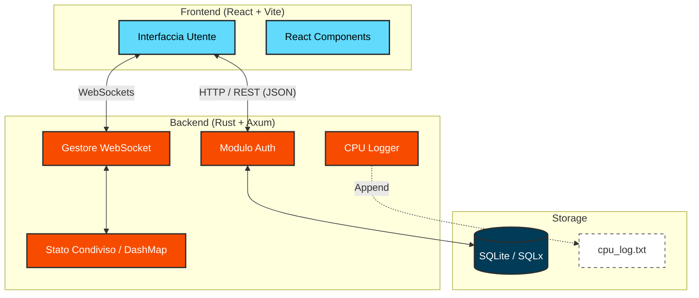
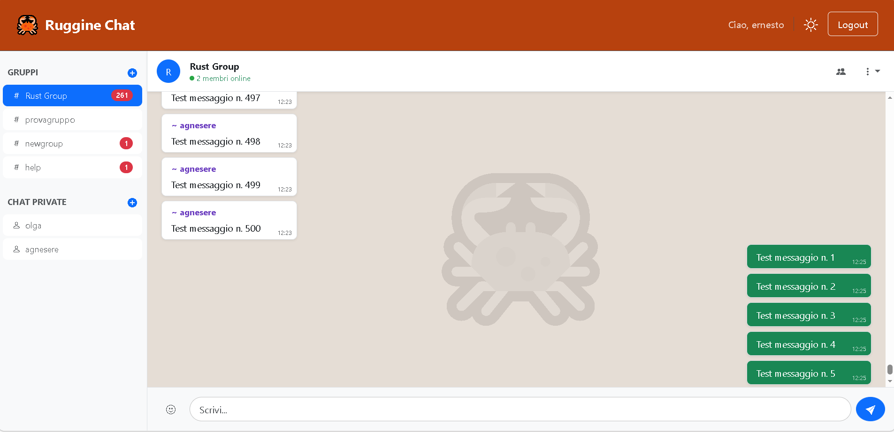

<!-- omit in toc -->
# Ruggine 🦀 – Manuale Progettista
**Sistema di messaggistica Real-Time ad alte prestazioni**

**Corso:** Programmazione di Sistema (02GRSYG)  
**Anno Accademico:** 2024/2025  
**Politecnico di Torino**

---

<!-- omit in toc -->
### Gruppo di Sviluppo (G9)
* [Agnese Re](https://github.com/AgneseRe) – Matricola: s325676
* [Ilaria Sarcuni](https://github.com/IlariaSarcuni) – Matricola: s332008
* [Cosimo Sergi](https://github.com/Cosser99) – Matricola: s347914

**Repository Ufficiale:** [github.com/PdS2425-C2/G9](https://github.com/PdS2425-C2/G9)

---

<!-- omit in toc -->
## Indice

- [1. Introduzione](#1-introduzione)
  - [Modello di comunicazione](#modello-di-comunicazione)
- [2. Architettura del sistema e tecnologie](#2-architettura-del-sistema-e-tecnologie)
  - [⚙️ Backend](#️-backend)
  - [🎨 Frontend](#-frontend)
- [3. Backend: implementazione in Rust](#3-backend-implementazione-in-rust)
- [4. Modello dei Dati](#4-modello-dei-dati)
  - [Tabelle Database](#tabelle-database)
- [5. API REST](#5-api-rest)
  - [5.1 APIs autenticazione e gestione utente](#51-apis-autenticazione-e-gestione-utente)
  - [5.2 APIs chat private](#52-apis-chat-private)
  - [5.3 APIs team](#53-apis-team)
  - [5.4 APIs inviti](#54-apis-inviti)
- [6. WebSocket](#6-websocket)
- [7. Frontend: Integrazione React](#7-frontend-integrazione-react)
- [8. Avvio del progetto in sviluppo](#8-avvio-del-progetto-in-sviluppo)
  - [Backend](#backend)
  - [Frontend](#frontend)
- [9. Monitoraggio risorse](#9-monitoraggio-risorse)
  - [Osservazioni](#osservazioni)

---

## 1. Introduzione

*Ruggine Chat* è una piattaforma di messaggistica istantanea multi-utente, progettata per garantire comunicazioni sicure e in tempo reale, poggiandosi su un modello *client-server*. Basata su un backend asincrono in Rust, dedicato alla gestione delle sessioni, della logica di comunicazione e del monitoraggio delle risorse, e su un frontend in React, per un'interfaccia moderna e reattiva, Ruggine Chat si articola attraverso un'architettura che mira a massimizzare la reattività del sistema, riducendo al minimo l'impiego delle risorse hardware utilizzate.

### Modello di comunicazione
L'applicazione adotta un modello di comunicazione ibrido tra frontend e backend, combinando tradizionali *richieste HTTP* con il protocollo *WebSocket*. In particolare, lo scambio di dati viene ottimizzato a seconda della natura dell'operazione.

- **HTTP REST**: per tutte le operazioni puntuali, dunque quelle che non richiedono connessioni persistenti, il frontend React comunica con il backend Rust tramite richieste HTTP. Questo approccio è riservato a funzionalità quali autenticazione (login e registrazione), creazione di team e chat private, gestione inviti, recupero storico messaggi. 
- **WebSocket**: per tutte le funzionalità che richiedono aggiornamenti in tempo reale, il sistema effettua l'*upgrade* della connessione HTTP al protocollo WebSocket. Una volta verificata l'identità dell'utente, un canale full-duplex permanente viene creato. Questo consente al server di operare in modalità *push*, inviando i messaggi ricevuti verso i client istantaneamente, abbattendo i tempi di latenza tipici delle tecniche di polling.

---

## 2. Architettura del sistema e tecnologie



L’architettura di *Ruggine Chat* si avvale di uno stack tecnologico all'avanguardia, dove la scelta di ciascun componente è stata guidata dalla necessità di coniugare elevate prestazioni computazionali a una gestione rigorosa della sicurezza dei dati. I principali componenti, le tecnologie e le relative funzionalità sono illustrati di seguito.

### ⚙️ Backend

| Componente | Tecnologia | Funzionalità |
|---|---|---|
| Linguaggio | Rust | Garantisce sicurezza della memoria ed elevate prestazioni. |
| Framework HTTP | Axum 0.8.1 | Gestisce il routing e l'integrazione dei middleware. |
| Runtime asincrono | Tokio 1.42.0 | Fornisce l'infrastruttura per la gestione di task simultanei senza bloccare il thread principale. |
| Database | SQLite (SQLx 0.8.3) | Gestisce la persistenza dei dati. |
| Sessioni/Auth | axum_session + auth | Gestisce il ciclo di vita delle sessioni utente e la protezione delle rotte tramite autenticazione persistente. |
| Hashing password | bcrypt 0.16.0 | Fornisce un algoritmo di cifratura sicuro per l'archiviazione delle credenziali nel database. |
| WebSocket | Axum ws + futures-util | Implementa comunicazione bidirezionale per lo scambio di messaggi in tempo reale. |

### 🎨 Frontend

| Componente | Tecnologia | Funzionalità |
|---|---|---|
| Linguaggio | JavaScript (ES Modules) | Standard moderno per lo sviluppo della logica lato client. |
| Framework UI | React 19.1.1 | Gestisce il rendering dell'interfaccia e lo stato reattivo dei componenti. |
| Build tool | Vite 7.1.7 | Strumento di generazione del bundle ottimizzato per alte prestazioni in fase di sviluppo e build. |
| Routing | React Router DOM 7.9.4 | Gestisce la navigazione tra le diverse viste dell'applicazione. |
| Componenti UI | React-Bootstrap 2.10.10 | Fornisce una libreria di componenti pronti all'uso, accessibili e integrati con Bootstrap 5. |

---

## 3. Backend: implementazione in Rust

Il server è costruito attorno all'*ecosistema asincrono* di Rust. La sua logica applicativa è suddivisa in moduli distinti per facilitarne la leggibilità e la manutenibilità.

- `main.rs` (in `src/main.rs`): modulo per l'inizializzazione del server web. Configura il pool di connessioni al database, il runtime asincrono *Tokio*, le politiche di sessione e il routing principale di tutte le risorse API e WebSocket.

- `models.rs` (in `src/models.rs`): modulo per la definizione delle strutture dati condivise e delle entità del database. Mappa i record delle tabelle SQL in oggetti Rust e implementa i tratti necessari per l'autenticazione e la *serializzazione* JSON.

- `auth.rs` (in `src/handlers/auth.rs`): modulo per la gestione delle procedure di registrazione, login e logout. Utilizza la libreria *bcrypt* per il hashing delle password. Gestisce l'integrazione con *axum-session* per creare la sessione utente nella tabella `sessions_table` e inizializza lo stato di presenza dell'utente nella *presence_map* al momento del login.

- `team.rs` (in `src/handlers/team.rs`): modulo dedicato alla gestione dei team. Creazione di team, gestione degli inviti (invio e accettazione), e invio dei messaggi di gruppo.

- `personal.rs` (in `src/handlers/personal.rs`): modulo per la gestione delle chat private tra singoli utenti. Creazione nuove chat private, recupero della lista di chat esistenti, gestione dello stato di lettura.

- `presence.rs` (in `src/handlers/presence.rs`): modulo per il monitoraggio in tempo reale dello stato online degli utenti.

- `state.rs` (in `src/state.rs`): modulo per la gestione dello stato globale dell'applicazione `AppState`. Organizza le risorse condivise thread-safe come il pool del database, i canali di trasmissione della chat e le mappe di presenza degli utenti.

- `tasks.rs` (in `src/tasks.rs`): modulo per l'esecuzione di operazioni asincrone in background, specificamente dedicato al monitoraggio periodico delle risorse hardware (CPU e tempo di esecuzione) e alla loro archiviazione in file di log locali.

- `ws.rs` (in `src/ws.rs`): modulo per la gestione delle connessioni **WebSocket**, che regolamenta lo scambio di messaggi in tempo reale e la notifica degli eventi di presenza (online/offline) per i team e le comunicazioni private, previa verifica dei permessi.

- `error.rs` (in `src/error.rs`): modulo per la centralizzazione e la gestione degli errori applicativi. Definisce l'enum `AppError` e implementa la conversione automatica dai tipi di errore di sistema (e.g. *SQLx*, *Anyhow*) in risposte HTTP coerenti.

---

## 4. Modello dei Dati
L'applicazione utilizza **SQLite** come motore di database relazionale, gestito mediante la libreria asincrona *SQLx*. Una scelta che non solo garantisce la persistenza delle credenziali utente, dei messaggi inviati e  delle configurazioni dei team e delle chat private, ma che assicura al contempo un'infrastruttura leggera e portabile. L'intero database risiede infatti all'interno di un singolo file su disco. Ciò elimina la necessità di complesse installazioni e setup lato server,  facilitando sensibilmente le operazioni di backup, copia o migrazione del sistema.

### Tabelle Database
- Tabella `user` - contiene le informazioni relative a tutti gli utenti registrati (id*, username, password). L'utente effettua il login tramite username e password. Il campo *password* contiene l'hash della password, generato tramite l'utilizzo dell'algoritmo *bcrypt* con un fattore di costo pari a 10. Questa tecnica garantisce che, anche in caso di accesso non autorizzato al database, le password originali rimangano protette.

- Tabella `team` - contiene le informazioni relative ai team creati (id*, name).

- Tabella `user_team` - contiene tutte le informazioni relative all'appartenenza di un dato utente ad uno specifico team (id_user*, id_team*, last_data, last_ora). Uno stesso utente può appartenere a più team. Per ciascun utente in ciascun team è memorizzata la data e l'ora dell'ultima attività, utili per determinare lo stato di lettura delle conversazioni. Confrontando i dati temporali dell'ultima attività dell'utente con il timestamp dei messaggi archiviati, il sistema è in grado di calcolare dinamicamente il numero di messaggi non letti per ogni specifico team.

- Tabella `user_team_join` - contiene le informazioni relative al momento di ingresso di un dato utente in un dato team (id_user*, id_team*, joined_at). Una tabella statica, contenente dati storici, che viene mantenuta separata dalla precedente invece aggiornata dinamicamente.

- Tabella `invite` - mantiene le informazioni relative agli inviti *pendenti* (non ancora accettati) per divenire membro di un team (id_user*, id_team*, id_invited_by). É possibile divenire membro di un team solo in seguito alla ricezione e successiva accettazione di un invito, generato da un altro utente già appartente al team di riferimento.

- Tabella `message` - tiene traccia dei messaggi inviati all'interno dei team (id_message*, id_user, id_team, message, data, ora, type). Sono qui memorizzati sia messaggi di tipo *chat*, dunque comunicazioni testuali generate direttamente dagli utenti, sia messaggi di tipo *system* (e.g. "utente1 è entrato nel gruppo" oppure "utente2 ha abbandonato il gruppo").

- Tabella `private_chats_assoc` - mantiene le informazioni relative alle chat private instaurate (id*, id_user1, id_user2, last_data_user1, last_ora_user1, last_data_user2, last_ora_user2). Per entrambi gli utenti appartenenti ad una chat privata è memorizzata la data e l'ora dell'ultima attività, al fine di determinare lo stato di lettura delle conversazioni e segnalare la presenza di nuovi contenuti non ancora visualizzati.

- Tabella `private_messages` - tiene traccia dei messaggi inviati all'interno di una chat privata (id_chat, message, data, ora, name1, name2, type). Ogni record rappresenta un'interazione. I campi *name1* e *name2* identificano rispettivamente il mittente e il destinatario del messaggio.

- Tabella `session_table` - archivia i dati relativi alle sessioni attive degli utenti (id*, expires, session). A scopo di test, si adotta una politica di autenticazione non persistente (`longterm: false`). I dati di sessione scadono alla chiusura del browser. Qualora il browser rimanga aperto, la validità dell'accesso è limitata dal campo *expires*.

---

## 5. API REST

### 5.1 APIs autenticazione e gestione utente

| Metodo | Endpoint | Descrizione | Auth |
| :--- | :--- | :--- | :--- |
| **POST** | `/register` | Registrazione di un nuovo utente nel sistema. | No |
| **POST** | `/login` | Validazione delle credenziali e inizializzazione della sessione. | No |
| **GET** | `/logout` | Terminazione della sessione attiva. | Sì |
| **GET** | `/me` | Restituisce `{ id, username }` dell'utente loggato. | Sì |

### 5.2 APIs chat private

| Metodo | Endpoint | Descrizione | Auth |
| :--- | :--- | :--- | :--- |
| **POST** | `/create/private` | Crea una nuova chat privata tra due utenti. | Sì |
| **GET** | `/list/private` | Recupera l'elenco di tutte le chat private dell'utente corrente. | Sì |
| **GET** | `/chat/messages/{chat_id}` | Restituisce lo storico dei messaggi per una specifica chat privata. | Sì |
| **POST** | `/chat/send` | Invia un nuovo messaggio all'interno di una chat privata. | Sì |
| **GET** | `/private/{chat_id}/online` | Monitora e gestisce lo stato di presenza (online/offline) nella chat. | Sì |
| **GET** | `/private-unread-notifications` | Restituisce il conteggio dei messaggi non letti per tutte le chat private. | Sì |
| **POST** | `/mark-read-private/{chat_id}` | Contrassegna come *letti* i messaggi di una specifica chat privata. | Sì |

### 5.3 APIs team

| Metodo | Endpoint | Descrizione | Auth |
| :--- | :--- | :--- | :--- |
| **GET** | `/list/teams` | Recupera l'elenco dei team di cui l'utente è membro. | Sì |
| **POST** | `/create` | Crea un nuovo team. | Sì |
| **POST** | `/rename` | Modifica il nome di un team esistente. | Sì |
| **POST** | `/leave` | Rimuove l'utente corrente da un team. | Sì |
| **GET** | `/team/{team_id}/members` | Restituisce l'elenco completo dei membri di un team. | Sì |
| **GET** | `/team/{team_id}/online` | Restituisce l'elenco dei membri attualmente online nel team. | Sì |
| **GET** | `/messages?team_id={id}` | Recupera lo storico dei messaggi inviati all'interno di un team. | Sì |
| **POST** | `/send` | Invia un nuovo messaggio nel team. | Sì |
| **GET** | `/unread-notifications` | Restituisce il conteggio dei messaggi non letti per i team dell'utente. | Sì |
| **POST** | `/mark-read/{team_id}` | Contrassegna come *letti* i messaggi di uno specifico team. | Sì |

### 5.4 APIs inviti

| Metodo | Endpoint | Descrizione | Auth |
| :--- | :--- | :--- | :--- |
| **GET** | `/list/invites` | Recupera la lista di tutti gli inviti pendenti ricevuti dall'utente. | Sì |
| **POST** | `/invite` | Invia una richiesta di partecipazione a un team a un altro utente. | Sì |
| **POST** | `/accept` | Accetta l'invito ricevuto e aggiunge l'utente ai membri del team. | Sì |
| **POST** | `/decline` | Rifiuta l'invito ricevuto, rimuovendolo dalle notifiche pendenti. | Sì |

---

## 6. WebSocket

Il backend espone tre endpoint WebSocket, tutti protetti da un *middleware* di autenticazione. Prima di ogni upgrade, il server esegue una verifica dei permessi. In caso di accesso non autorizzato, la connessione viene rifiutata con `403 Forbidden`.

- `/ws/team/{id}`: connessione WebSocket per una stanza di team. Prima dell'upgrade, il backend verifica tramite query SQL che l'utente sia membro del team. Una volta connesso, il client riceve in tempo reale tutti i messaggi inviati da qualunque membro del gruppo, nonché gli eventi di presenza (online/offline) degli altri partecipanti.

- `/ws/private/{id}`: connessione WebSocket per una chat privata. Prima dell'upgrade, il backend verifica che l'utente sia uno dei due partecipanti della chat. Il funzionamento è analogo alla stanza di team, ma limitato ai soli due utenti coinvolti.

- `/ws/global`: connessione WebSocket globale per la gestione della presenza. Viene aperta dal frontend non appena l'utente effettua il login e rimane attiva per tutta la sessione. Alla connessione l'utente viene registrato nella `presence_map` e viene notificata la sua presenza online a tutti i canali broadcast attivi (team e chat private) a cui appartiene. Alla disconnessione viene rimosso dalla mappa e notificata la sua assenza.

---

## 7. Frontend: Integrazione React
- `App` (in `src/App.jsx`): componente principale dell'applicazione. Avvolge tutti i componenti in un *ThemeContext.Provider* per gestire il tema (chiaro oppure scuro) e utilizza *Routes* e *Route* di *react-router-dom* per definire la navigazione.

- `LoginForm` (in `src/components/auth/AuthComponents.jsx`): contiene il form per effettuare il login, con i due campi di input necessari (*Username* e *Password*). Controlla le credenziali inserite (dopo aver cliccato sul bottone *Accedi*) e reindirizza l'utente alla pagina in cui partecipare ad una conversazione, in caso di login effettuato con successo. Il form contiene anche un bottone *Registrati* che rimanda l'utente alla pagina di registrazione.

- `RegisterForm` (in `src/components/auth/AuthComponents.jsx`): contiene il form per effettuare la registrazione, con i tre campi di input necessari (*Username*, *Password* e *Conferma Password*). Al click del bottone *Crea Account*, controlla i dati inseriti (*username* disponibile, password con minimo numero di caratteri, password coincidenti) e reindirizza l'utente alla pagina in cui effettuare il login. Il form contiene anche un bottone *Accedi* che rimanda l'utente alla pagina di login.

- `ChatModals` (in `src/components/chat/ChatModals.jsx`): componente che raccoglie tutte le finestre di dialogo dell'interfaccia chat. Modale per la creazione di un nuovo team, avvio di una nuova chat privata, rinomina di un team esistente, invito di un utente in un team, lista dei membri di un team con indicatori online/offline.

- `ChatPage` (in `src/components/chat/ChatPage.jsx`): componente principale della chat. Gestisce il caricamento della lista dei team e delle chat private di cui l'utente fa parte, la gestione degli inviti pendenti, la selezione della stanza attiva.

- `ChatWindow` (in `src/components/chat/ChatWindow.jsx`): finestra di chat attiva. Gestisce la distinzione visiva tra messaggi propri e altrui, la separazione temporale dei messaggi tramite badge, il selettore emojii, lo scrollo automatico verso il basso.

-  `NavHeader` (in `src/components/common/NavHeader.jsx`): barra di navigazione, contenente nome e logo dell'applicazione. In caso di utente loggato contiene il bottone di *Logout* e un messaggio di benvenuto (*e.g.* Ciao, *username*). Un bottone (con icona bootstrap *bi-sun* o *bi-moon*) consente inoltre di impostare la modalità chiara o la modalità scura (*dark mode* oppure *light mode*).

- `NotFoundComponent` (in `src/components/common/NotFoundComponent.jsx`): contiene un messaggio informativo che comunica all'utente che la pagina cercata non è stata trovata. Presenta un bottone *Ritorna all'homepage* che reindirizza l'utente alla pagina principale dell'applicazione.

---

## 8. Avvio del progetto in sviluppo

### Backend

```bash
# Dalla directory backend/
cargo run
# Il server si avvia su 0.0.0.0:3000
```

Il build di release è configurato in `Cargo.toml` con ottimizzazioni per la dimensione del binario (`opt-level = "z"`, `lto = true`, `codegen-units = 1`, `strip = true`, `panic = "abort"`):

```bash
cargo build --release
./target/release/backend
```
> **Dimensione binario release** `backend.exe`: **2.27 MB (2.383.872 byte)**.

### Frontend

```bash
# Dalla directory frontend/
npm install      # al primo avvio o dopo aggiornamenti dipendenze
npm run dev
```

Il frontend si connette automaticamente al backend sulla porta `3000` dello stesso host, grazie alla funzione `getBaseUrl()` in `API.js`. 

> **Dimensione bundle statico**: **2.02 MB (2.121.728 byte)** (codice JavaScript minificato e asset ottimizzati).

---

## 9. Monitoraggio risorse

Il sistema integra un modulo dedicato al *monitoraggio* delle risorse. Attraverso un task asincrono gestito dal runtime *Tokio*, viene eseguito un campionamento periodico ogni **120 secondi**. In particolare, è tracciata la percentuale di utilizzo della CPU e il tempo di attività del processo. I dati raccolti vengono salvati e aggiornati progressivamente nel file di log `backend/cpu_log.txt`. Ogni voce del file segue la sintassi di seguito riportata:

```
[DD-MM-YYYY HH:MM:SS] CPU Usage: X.XX% | Runtime: Xs | Cores: X
```
dove:
- `DD-MM-YYYY HH:MM:SS`: rappresenta il timestamp locale al momento della rilevazione.
- `CPU Usage`: rappresenta la percentuale di utilizzo della CPU come media nel periodo di riferimento (120s). In macchine *multi-core* può essere superiore al 100%.
- `Runtime`: indica il tempo totale di attività del processo dall'avvio, espresso in secondi.
- `Cores`: riporta il numero di core logici rilevati dal sistema, utile per normalizzare il dato di utilizzo della CPU.


### Osservazioni

Dall'analisi del file `backend/cpu_log.txt` generato durante lo sviluppo e il testing dell'applicazione emergono le seguenti osservazioni:

- **Utilizzo CPU in condizioni idle**: con pochi utenti connessi che non interagiscono tra loro, la percentuale di utilizzo della CPU si attesta tipicamente tra 0.01% e 0.50%. Questo conferma l'efficienza del runtime asincrono *Tokio*, che non spreca cicli CPU in attesa passiva di eventi.
- **Utilizzo medio sotto carico**: durante le sessioni di test con più utenti connessi e scambio attivo di messaggi in chat private e team, il consumo si attesta stabilmente tra **0.50% e 2.00%**.
- **Utilizzo sotto stress**: durante i test di carico intensivi, simulando l'invio massivo di messaggi tramite script *JavaScript* automatizzati iniettati direttamente nella console degli strumenti per sviluppatori del browser, il consumo della CPU ha raggiunto picchi vicini al 5.00%. Il backend risulta dunque estremamente leggero anche in condizioni di stress, confermando la validità della scelta di *Rust* come linguaggio per il server dell'applicazione. 

Un esempio di script di test utilizzato su una chat di gruppo è il seguente:

```javascript
async function stressTest(numeroMessaggi, delayMs) {
    const teamId = 4; // l'utente loggato deve appartenere al team
    const endpoint = 'http://localhost:3000/send';
    
    console.log(`%c Avvio stress test: ${numeroMessaggi} messaggi...`, 'color: orange; font-weight: bold;');
    
    let successi = 0;
    let errori = 0;

    for (let i = 1; i <= numeroMessaggi; i++) {
        try {
            const response = await fetch(endpoint, {
                method: 'POST',
                headers: { 'Content-Type': 'application/json' },
                credentials: 'include', 
                body: JSON.stringify({
                    team_id: teamId,
                    message: `Test messaggio n. ${i}`
                })
            });

            if (response.ok) {
                successi++;
            } else {
                errori++;
                console.error(`Errore al messaggio ${i}: ${response.status}`);
            }
        } catch (e) {
            errori++;
            console.error(`Errore di rete al messaggio ${i}`);
        }

        // Log ogni 50 messaggi
        if (i % 50 === 0) {
            console.log(`Progresso: ${i}/${numeroMessaggi}...`);
        }

        await new Promise(resolve => setTimeout(resolve, delayMs));
    }

    console.log(`%c TEST COMPLETATO!`, 'color: green; font-weight: bold;');
    console.table({ Successi: successi, Errori: errori, Totale: numeroMessaggi });
}

stressTest(500, 10);  // esecuzione stress test. 500 messaggi, uno ogni 10 ms
```
Di seguito è riportato ciò che risulta in una chat di gruppo durante uno **stress test**. L'ora di ciascun messaggio inviato conferma l'alta velocità di elaborazione del server.

