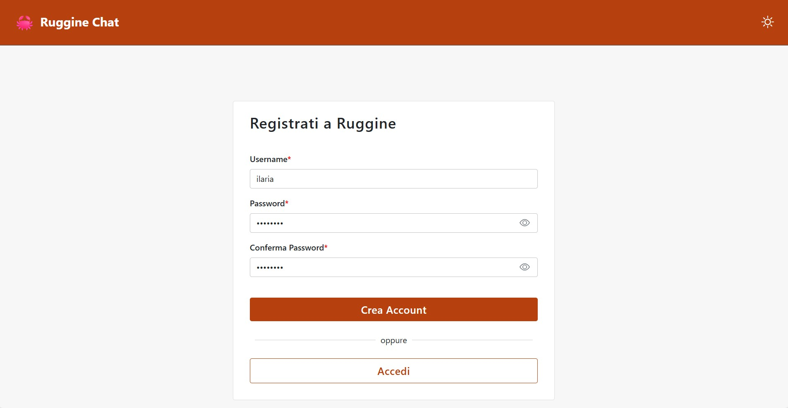
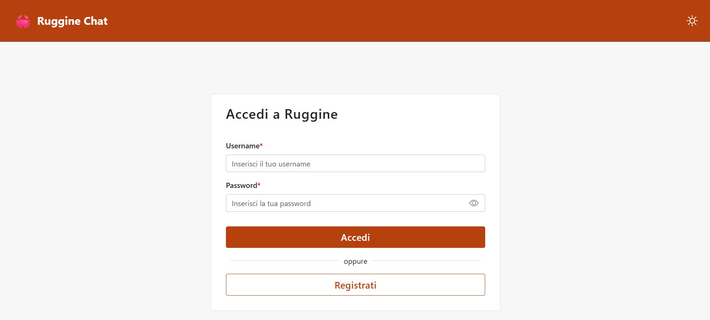
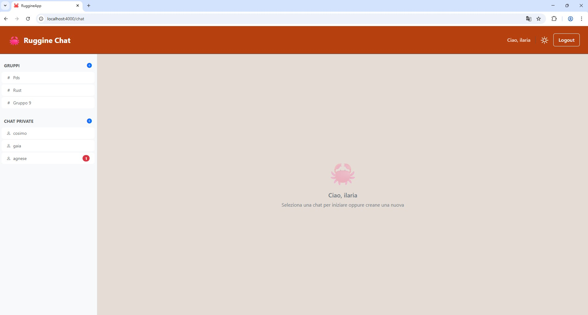
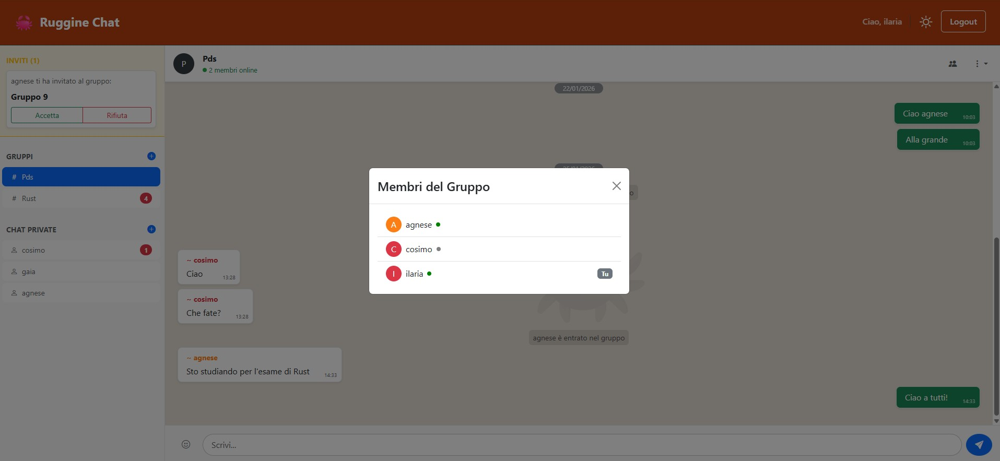
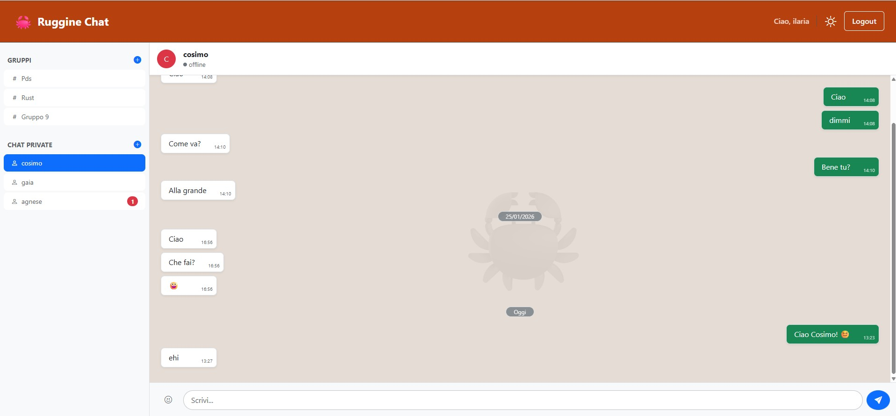

# Ruggine Chat 🦀 – Manuale Utente
**Sistema di messaggistica Real-Time ad alte prestazioni**

**Corso:** Programmazione di Sistema (02GRSYG)  
**Anno Accademico:** 2024/2025  
**Politecnico di Torino**

---

### Gruppo di Sviluppo (G9)
* [Agnese Re](https://github.com/AgneseRe) – Matricola: s325676
* [Ilaria Sarcuni](https://github.com/IlariaSarcuni) – Matricola: s332008
* [Cosimo Sergi](https://github.com/Cosser99) – Matricola: s347914

**Repository Ufficiale:** [github.com/PdS2425-C2/G9](https://github.com/PdS2425-C2/G9)

---

## Indice
 
1. [Introduzione](#1-introduzione)
2. [Requisiti di sistema](#2-requisiti-di-sistema)
3. [Installazione e avvio](#3-installazione-e-avvio)
4. [Accesso all'applicazione](#4-accesso-allapplicazione)
5. [Registrazione](#5-registrazione)
6. [Login](#6-login)
7. [Interfaccia principale](#7-interfaccia-principale)
8. [Chat di gruppo (Team)](#8-chat-di-gruppo-team)
9. [Chat private](#9-chat-private)
10. [Inviti e notifiche](#10-inviti-e-notifiche)
11. [Impostazioni e preferenze](#11-impostazioni-e-preferenze)
12. [Logout](#12-logout)
13. [Errori comuni e soluzioni](#13-errori-comuni-e-soluzioni)
 
---
 
## 1. Introduzione
 
**Ruggine Chat** è un'applicazione web di messaggistica in tempo reale che consente agli utenti di comunicare tramite chat di gruppo e chat private uno-a-uno. L'applicazione supporta la presenza online in tempo reale, le notifiche di messaggi non letti, gli inviti ai gruppi e la personalizzazione del tema visivo.
 
Il nome "Ruggine" richiama il linguaggio di programmazione **Rust**, con cui è sviluppato il backend dell'applicazione.
 
---
 
## 2. Requisiti di sistema
 
### Software
 
| Componente | Versione minima richiesta |
|---|---|
| Sistema operativo | Windows 10+, macOS 12+, Linux (qualsiasi distribuzione recente) |
| Browser | Chrome, Firefox, Edge, Safari (versioni aggiornate) |
| Node.js | ≥ 18.18.0 (necessario per avviare il frontend in locale) |
| npm | ≥ 9.x (incluso con Node.js 18) |
| Rust toolchain | ≥ 1.85 (installabile tramite [rustup](https://rustup.rs/)) |
 
---
 
## 3. Installazione e avvio
 
Questa sezione è destinata a chi deve avviare l'applicazione in locale.
### 3.1 Download del progetto
 
Clonare il repository dal controllo di versione oppure estrarre l'archivio `.zip` fornito. Il progetto è organizzato in due cartelle principali:
 
```
progetto/
├── backend/    → server API in Rust
└── frontend/   → applicazione web in React + Vite
```
 
### 3.2 Avvio del backend (Rust)
 
```bash
cd backend
cargo run
```
 
Al primo avvio, Cargo scarica automaticamente tutte le dipendenze indicate in `Cargo.toml`. Il server si avvia sulla porta **3000** e rimane in ascolto su `0.0.0.0:3000`. Il file `db.sqlite` deve essere presente nella stessa cartella.
 
Per un build ottimizzato (produzione):
 
```bash
cargo build --release
./target/release/backend
```
 
### 3.3 Avvio del frontend (Node.js + Vite)
 
```bash
cd frontend
npm install      # solo al primo avvio o dopo aggiornamenti
npm run dev
```
 
Il frontend sarà accessibile su **http://localhost:4000** e comunicherà automaticamente con il backend su porta 3000 dello stesso host.
 
Per build di produzione (genera i file statici in `dist/`):
 
```bash
npm run build
```

---
 
## 4. Accesso all'applicazione
 
Aprire il browser e navigare all'indirizzo fornito.
 
L'applicazione reindirizza automaticamente alla pagina di login.
 
---
 
## 5. Registrazione



Per creare un nuovo account:
 
1. Dalla pagina di login, fare clic sul pulsante **Registrati**.
2. Nella pagina di registrazione, compilare i campi obbligatori:
   - **Username**: deve contenere almeno 3 caratteri. Lo username deve essere univoco nel sistema.
   - **Password**: deve contenere almeno 8 caratteri.
   - **Conferma Password**: ripetere la password inserita nel campo precedente.
3. Fare clic su **Crea Account**.
 
Se la registrazione va a buon fine, viene mostrato un messaggio di conferma e l'utente viene reindirizzato alla pagina di login. In caso di errore (ad esempio username già in uso), viene visualizzato un messaggio di errore in rosso.
 
> **Nota:** I campi contrassegnati con `*` sono obbligatori. Entrambi i campi password dispongono di un pulsante per mostrare o nascondere la password inserita.
 
---
 
## 6. Login


 
Per accedere all'applicazione:
 
1. Nella pagina di login, inserire il proprio **Username** e la propria **Password**.
2. Fare clic su **Accedi**.
 
Se le credenziali sono corrette, si viene reindirizzati alla pagina principale della chat. In caso di credenziali errate, viene mostrato un messaggio di errore.
 
> **Nota:** Se si è già autenticati, l'applicazione reindirizza automaticamente alla chat senza mostrare la pagina di login.
 
---
 
## 7. Interfaccia principale


 
Una volta effettuato il login, si accede alla pagina principale, composta da tre aree:
 
### 7.1 Barra di navigazione (in alto)
 
La barra superiore è sempre visibile e contiene:
- **Logo e nome** dell'applicazione (🦀 Ruggine Chat), cliccabile per tornare alla home.
- **Nome utente** dell'utente autenticato.
- **Pulsante tema** (☀️ / 🌙): alterna tra la modalità chiara e quella scura. La preferenza viene salvata e mantenuta tra le sessioni.
- **Pulsante Logout**: termina la sessione.
 
### 7.2 Colonna laterale sinistra (sidebar)
 
Contiene l'elenco delle conversazioni attive, divise in due sezioni:
 
- **Gruppi**: lista di tutti i team di cui si è membri.
- **Chat private**: lista di tutte le conversazioni private avviate.
 
Ogni voce nella lista mostra il nome del gruppo o dell'utente con cui si conversa. Un **badge numerico rosso** indica il numero di messaggi non letti in quella conversazione.
 
Nella parte inferiore della sidebar sono presenti i pulsanti per:
- Creare un nuovo gruppo.
- Avviare una nuova chat privata.
- Visualizzare gli inviti ricevuti.
 
### 7.3 Finestra di chat (area centrale)
 
Occupa la parte principale dello schermo. Quando nessuna conversazione è selezionata, viene mostrata una schermata di benvenuto. Selezionando una conversazione dalla sidebar, si apre la finestra di chat corrispondente.
 
---
 
## 8. Chat di gruppo (Team)



### 8.1 Entrare in un gruppo
 
Per accedere a un gruppo già esistente di cui si è membri, fare clic sul suo nome nella sidebar. I messaggi vengono caricati e la finestra di chat si aggiorna automaticamente.
 
### 8.2 Creare un nuovo gruppo
 
1. Fare clic sul pulsante **Nuovo Gruppo** (icona `+`) nella sidebar.
2. Nella finestra che appare, inserire il nome del gruppo.
3. Fare clic su **Crea gruppo**.
 
Il nuovo gruppo apparirà immediatamente nella propria lista.
 
### 8.3 Inviare un messaggio in un gruppo
 
1. Selezionare il gruppo dalla sidebar.
2. Digitare il messaggio nel campo di testo in basso.
3. Premere **Invio** oppure fare clic sul pulsante di invio.
 
I messaggi degli altri partecipanti appaiono sulla sinistra; i propri messaggi appaiono sulla destra. Ogni messaggio mostra il nome del mittente (nei gruppi) e l'orario di invio.
 
È possibile inserire **emoji** nel messaggio facendo clic sull'icona '😊' a sinistra del campo testo, che apre un selettore emoji.
 
### 8.4 Visualizzare i membri del gruppo
 
Fare clic sull'icona '👥' in alto a destra nella finestra di chat. Si apre una modale con la lista di tutti i membri, il loro indicatore di presenza (🟢 online / ⚫ offline) e un badge **Tu** in corrispondenza del proprio username.
 
### 8.5 Invitare un utente nel gruppo
 
1. Fare clic sull'icona ⋮ (tre puntini verticali) in alto a destra.
2. Selezionare **Invita Utente**.
3. Inserire lo username dell'utente da invitare.
4. Fare clic su **Invia**.
 
L'utente invitato riceverà una notifica di invito.
 
### 8.6 Rinominare il gruppo
 
1. Fare clic sull'icona ⋮ in alto a destra.
2. Selezionare **Rinomina Gruppo**.
3. Inserire il nuovo nome e fare clic su **Salva**.
 
### 8.7 Abbandonare un gruppo
 
1. Fare clic sull'icona ⋮ in alto a destra.
2. Selezionare **Abbandona Gruppo** (voce in rosso).
 
Il gruppo viene rimosso dalla propria lista. Gli altri membri non vengono influenzati.
 
### 8.8 Presenza online nel gruppo
 
Nell'intestazione della finestra di chat di gruppo è indicato il numero di **membri attualmente online**. Il contatore si aggiorna in tempo reale.
 
---
 
## 9. Chat private

 

### 9.1 Avviare una nuova chat privata
 
1. Fare clic sul pulsante **Nuova Chat** (icona `+`) nella sezione chat private della sidebar.
2. Nella modale, inserire lo username dell'utente con cui si desidera chattare.
3. Fare clic su **Avvia chat**.
 
Se esiste già una chat con quell'utente, viene aperta quella esistente.
 
> **Nota:** Non è possibile avviare una chat con se stessi.
 
### 9.2 Inviare un messaggio privato
 
Il funzionamento è identico a quello delle chat di gruppo. Digitare il messaggio nel campo in basso e inviarlo premendo Invio o il pulsante di invio.
 
### 9.3 Presenza nella chat privata
 
Nell'intestazione della chat privata è indicato se l'altro utente è **online** o **offline** in tempo reale, tramite un indicatore verde o grigio.
 
---
 
## 10. Inviti e notifiche
 
### 10.1 Inviti ai gruppi
 
Quando si viene invitati a un gruppo, appare una **sezione inviti** nella sidebar con il nome del gruppo e il nome di chi ha inviato l'invito. È possibile:
 
- Fare clic su **Accetta** per entrare nel gruppo.
- Fare clic su **Rifiuta** per declinare l'invito.
 
### 10.2 Messaggi non letti
 
Un **badge numerico** accanto al nome di un gruppo o di una chat privata indica quanti messaggi non sono ancora stati letti. Il badge scompare automaticamente quando si apre la conversazione.
 
---
 
## 11. Impostazioni e preferenze
 
### 11.1 Tema chiaro / scuro
 
Fare clic sull'icona ☀️ o 🌙 nella barra di navigazione per alternare tra tema chiaro e tema scuro. La scelta viene salvata nel browser e mantenuta tra le sessioni successive.
 
Il tema chiaro usa sfondi bianchi, al contrario, il tema scuro usa sfondi scuri con testo chiaro, adatto a condizioni di scarsa luminosità. 
 
---
 
## 12. Logout
 
Per uscire dall'applicazione, fare clic sul pulsante **Logout** nella barra di navigazione in alto a destra. La sessione viene terminata e si viene reindirizzati alla pagina di login.
 
---
 
## 13. Errori comuni e soluzioni
 
| Problema | Possibile causa | Soluzione |
|---|---|---|
| "Credenziali non valide" al login | Username o password errati | Verificare le credenziali inserite |
| "Username già in uso" alla registrazione | Lo username scelto è già occupato | Scegliere un username diverso |
| "Le password non coincidono" | I due campi password sono diversi | Reinserire la password con attenzione |
| "Utente non trovato" all'invito | L' username inserito non esiste | Verificare di aver scritto correttamente l' username |
| "Non puoi creare una chat con te stesso" | Si è inserito il proprio username | Inserire l' username di un altro utente |
| La pagina non carica | Il server non è raggiungibile | Verificare la connessione e che il server sia attivo |
| I messaggi non arrivano in tempo reale | Connessione WebSocket interrotta | Ricaricare la pagina |
| Pagina 404 | URL non valido | Fare clic sul link "Ritorna all'homepage" |
 